# 🔍 RAG System with FAISS + Milvus + Ollama + Azure OpenAI

This project implements a modular **Retrieval-Augmented Generation (RAG)** pipeline leveraging **FAISS**, **Milvus**, **Ollama**, and **Azure OpenAI**, consisting of two core microservices:

- 📄 `embedder` — Crawls and embeds documents to FAISS & Milvus vector stores.
- 🧠 `query-runner` — Handles user queries by retrieving relevant context and generating answers via LLM.

---

## 🧱 Architecture Diagram (Mermaid)

```mermaid
graph TD
    subgraph Source
        A1[📁 Local Folder]
        A2[🌐 SharePoint]
    end

    subgraph Embedder Service
        B1[📄 File Watcher & Parser]
        B2[✂️ Text Chunker]
        B3[🧠 Embedder Ollama / Azure]
        B4[📦 Vector Uploader]
        B5[📝 Metadata Store]
    end

    subgraph Vector Stores
        C1[📚 FAISS]
        C2[🧠 Milvus Lite]
    end

    subgraph Query Runner Service
        D1[❓ User Query Input]
        D2[🔍 Vector Search FAISS + Milvus]
        D3[📚 Context Assembler]
        D4[🧠 LLM Ollama / Azure OpenAI]
        D5[📝 Answer Response]
    end

    A1 --> B1
    A2 --> B1
    B1 --> B2 --> B3 --> B4
    B4 --> C1
    B4 --> C2
    B3 --> B5

    D1 --> D2
    C1 --> D2
    C2 --> D2
    D2 --> D3 --> D4 --> D5
```



> 💡 **Note**: Mermaid rendering is supported in GitHub markdown previews via compatible extensions or using Mermaid Live Editor ([link](https://mermaid.live/edit)).

---

## 📦 Technologies Used

| Component       | Tech Stack           |
|-----------------|----------------------|
| Embedding Store | FAISS, Milvus Lite   |
| LLM Integration | Ollama, Azure OpenAI |
| App Backend     | FastAPI              |
| UI/API Layer    | Optional: Streamlit/Gradio |
| Vectorization   | Sentence Transformers / Ollama Embedding |
| Deployment      | Docker, Helm, Kubernetes (Optional) |

---

## 🚀 Services

### 1. Embedder Service

Handles:
- Recursive folder scanning
- PDF/Text parsing
- Chunking and embedding using Ollama or Azure Embeddings
- Pushes vectors to FAISS and Milvus
- Metadata stored optionally in a JSON or NoSQL DB

**Run Locally**:

```bash
cd embedder
docker-compose up --build
```

**Main Endpoints**:
- `POST /embed/folder` – Watch or embed documents from local/share folder
- `POST /rebuild-index` – Rebuild FAISS and Milvus indices
- `GET /status` – Health check

---

### 2. Query Runner Service

Handles:
- Accepts user questions via API
- Retrieves top-k relevant chunks from FAISS and Milvus
- Feeds context + question to Ollama or Azure OpenAI for response generation

**Run Locally**:

```bash
cd query-runner
docker-compose up --build
```

**Main Endpoints**:
- `POST /query` – Ask a question and get an answer
- `GET /ping` – Health check

**Sample Query Payload**:
```json
{
  "question": "What are the main features of the document?",
  "top_k": 5
}
```

---

## ⚙️ Configuration

All environment configs should be defined in `.env` files per service:

**Common Variables**:
```
EMBEDDING_MODEL=ollama:all-minilm
VECTOR_DB=faiss,milvus
AZURE_API_KEY=your_azure_key
AZURE_DEPLOYMENT_NAME=your_deployment_name
```

---

## 🧪 Development

- Install dependencies:

```bash
pip install -r requirements.txt
```

- Run tests:

```bash
pytest
```

- Run with auto-reload (dev mode):

```bash
uvicorn main:app --reload
```

---

## 📦 Docker Compose

Run full system locally:

```bash
docker-compose -f docker-compose.full.yml up --build
```

---

## 🧠 Example Use Case

- Input: folder of PDFs from internal documentation
- Query: "What is the company’s onboarding process?"
- Output: Answer synthesized using retrieved document chunks + LLM

---

## 🔐 Security & Deployment

- Enable TLS via Nginx Ingress + cert-manager (if deployed on K8s)
- Use Helm chart for Kubernetes deployment
- Set up CI/CD via GitLab

---

## 📁 Folder Structure

```text
.
├── embedder/
│   ├── main.py
│   ├── embedding_utils.py
│   └── ...
├── query-runner/
│   ├── main.py
│   ├── retrieval_utils.py
│   └── ...
├── docker-compose.yml
├── README.md
└── helm/
```

---

## 🙌 Credits

Built by [Eltronesia Tech Consulting](https://www.instagram.com/eltronesia)  
With ❤️ using open-source tools and cutting-edge AI

---

## 📄 License

MIT License

